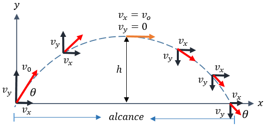

# Fisica-trabajo

trabajo tiro parabolico

Breve historia asociada (origen):
El concepto del tiro parabólico tiene sus raíces en la antigua Grecia. Fue estudiado por primera vez por el matemático y filósofo griego Aristóteles en el siglo IV a.C. Aristóteles observó que los objetos lanzados en el aire describen una trayectoria curva y desarrolló una teoría básica para describir este tipo de movimiento. A lo largo de los siglos, varios científicos y matemáticos, como Galileo Galilei y Sir Isaac Newton, han contribuido a nuestro entendimiento y desarrollo de las ecuaciones del tiro parabólico.

Matemática empleada:
El tiro parabólico utiliza conceptos y fórmulas de la física y la matemática. Algunas de las principales herramientas matemáticas utilizadas son:

1. Trigonometría: Se utilizan las funciones trigonométricas seno, coseno y tangente para calcular las componentes horizontal y vertical de la velocidad, así como para determinar ángulos y relaciones trigonométricas en la trayectoria.
2. Geometría analítica: Se utilizan conceptos de la geometría analítica, como las ecuaciones de una recta y la resolución de sistemas de ecuaciones, para describir y analizar la trayectoria del proyectil.
3. Cálculo diferencial: A través del cálculo diferencial, se derivan ecuaciones que describen la posición, velocidad y aceleración del proyectil en función del tiempo. Esto permite calcular y analizar diferentes parámetros de la trayectoria.

Cómo se resuelve:
El tiro parabólico se resuelve utilizando una serie de fórmulas y ecuaciones derivadas de los principios de la mecánica clásica. Algunas de las principales etapas para resolver el tiro parabólico son:

1. Recopilación de datos: Se recopilan los valores de la velocidad inicial (vi), el ángulo de lanzamiento (θ) y la gravedad (g) para el proyectil.
2. Conversión de unidades: Si es necesario, se convierten los valores ingresados a las unidades adecuadas (por ejemplo, convertir grados a radianes).
3. Cálculos iniciales: Se realizan cálculos iniciales, como el cálculo de las componentes horizontal y vertical de la velocidad inicial (vho y vver) y la conversión del ángulo a radianes.
4. Cálculos de la trayectoria: Se utilizan fórmulas derivadas de la física del movimiento para calcular diferentes parámetros de la trayectoria, como la altura máxima alcanzada (ymax), el alcance horizontal (xmax) y los tiempos de vuelo (tmax y tv).
5. Representación gráfica: Se utiliza una biblioteca gráfica, como Matplotlib, para representar visualmente la trayectoria del proyectil en un gráfico.

Aplicaciones:
El tiro parabólico tiene numerosas aplicaciones en la vida cotidiana y en diferentes campos científicos y tecnológicos. Algunas de las aplicaciones más comunes incluyen:

1. Deportes: El análisis del tiro parabólico se utiliza en deportes como el baloncesto, el fútbol y el golf para predecir la trayectoria de la pelota y calcular las fuerzas y ángulos necesarios para lograr determinados objetivos.
2. Proyectiles y balística: El tiro parabólico se utiliza en la balística para predecir la trayectoria de proyectiles, como balas y cohetes. Esto es importante para la seguridad, el diseño de armas y la precisión en la puntería.
3. Ingeniería de proyectiles: El diseño de proyectiles, como misiles y cohetes, requiere el análisis y la simulación del tiro parabólico para lograr un vuelo controlado y alcanzar objetivos específicos.
4. Juegos y simulaciones: El tiro parabólico se utiliza en juegos y simulaciones virtuales para crear experiencias realistas y calcular el movimiento de objetos en entornos virtuales.
5. Estudios científicos: El análisis del tiro parabólico se utiliza en diferentes estudios científicos, como la investigación de la trayectoria de partículas en física de partículas, el estudio del movimiento de objetos en la atmósfera terrestre y el análisis de fenómenos naturales, como la caída de meteoritos.

    
